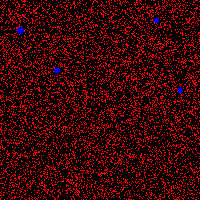
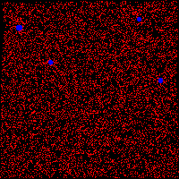

# Project 2: Simulate the Pool Table

Develop a simulation of 2D version of the pool table in one process, and then an Open MPI parallelized version. 

Source code can be obtained on [GitHub](https://github.com/poemonsense/nus-cs3211/tree/master/project2-openmpi). 

## Usage

```
Usage: pool <specfile > <ppmfile > [np]

  <specfile > path to specification file
  <ppmfile > output path to ppm file (without file extension)
  [np] number of processes or regions. Only for the sequential verison and should be a perfect square.
```

## Expected Results

Original board: 



Board after 25 steps:



Board after 50 steps:


Board after 75 steps:


Board after 100 steps (final result):


## More Information

See the [report](report.pdf). 